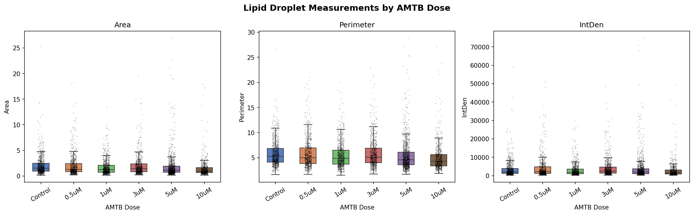
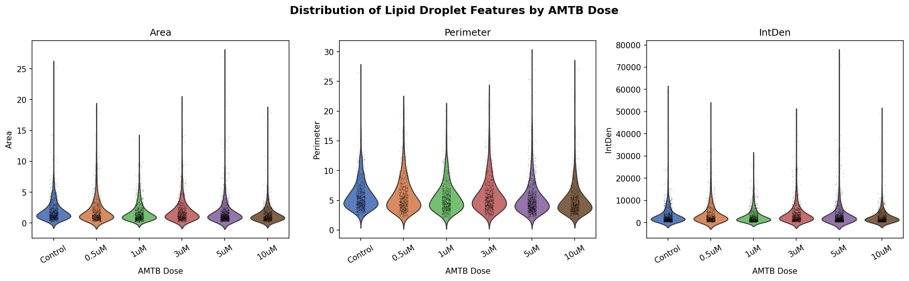
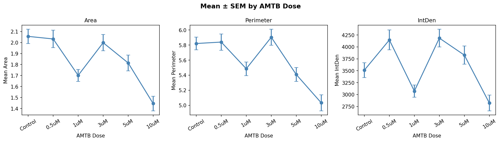
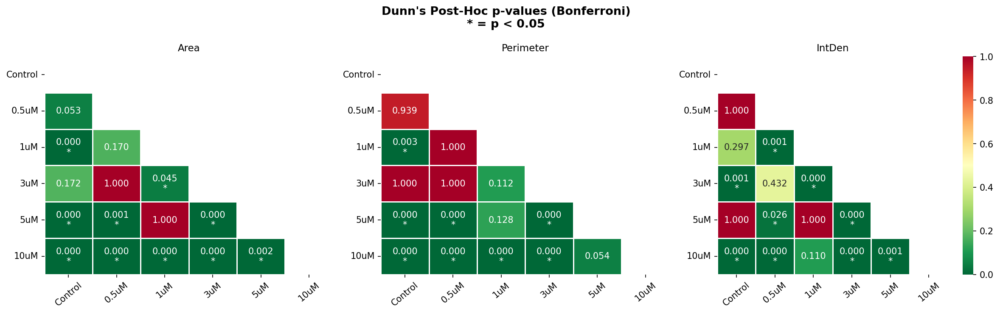

# AMTB Dose-Response Analysis: Lipid Droplet Morphology
This project analyzes lipid droplet measurements across different concentrations of AMTB to see how the treatment affects droplet size and intensity.

## Background
- AMTB is known to act as a blocker (antagonist) of the TRPM8 ion channel. TRPM8 is involved in calcium signaling and may play a role in cellular processes like metabolism and lipid regulation.
- In this study, cells were treated with different concentrations of AMTB, and lipid droplets were imaged using fluorescence microscopy. The goal is to check whether AMTB treatment is associated with any changes in lipid droplet morphology.
- Note: This analysis does not directly measure TRPM8 activity, so conclusions are limited to the effects of AMTB treatment, not the mechanism.

## Dataset
- **File:** `Dosage_Combined.csv`
- **Total observations:** 4,878 lipid droplets

### Columns

| Column      | Description                                                |
| ----------- | ---------------------------------------------------------- |
| `Dosage`    | AMTB concentration (Control, 0.5uM, 1uM, 3uM, 5uM, 10uM)   |
| `ImageID`   | Image identifier                                           |
| `Sl._No.`   | Droplet number in each image                               |
| `Area`      | Droplet area (µm²)                                         |
| `Perimeter` | Droplet perimeter (µm)                                     |
| `IntDen`    | Integrated fluorescence density                            |
| `RawIntDen` | Raw intensity *(removed since it was identical to IntDen)* |

### Sample Sizes

| Dosage  | n    |
| ------- | ---- |
| Control | 859  |
| 0.5 µM  | 734  |
| 1 µM    | 779  |
| 3 µM    | 764  |
| 5 µM    | 1098 |
| 10 µM   | 644  |

---

## Methods

### 1. Data Preparation
- Cleaned column names
- RawIntDen was removed since it was perfectly correlated with IntDen (r = 1.0)
- Set dosage as an ordered category
- Checked for missing values and duplicates

### 2. Exploratory Analysis
Basic summary statistics (mean, standard deviation, count) were calculated for each parameter across all dosage groups to understand the data distribution.

### 3. Statistical Tests
- Since the data did not follow a normal distribution (Shapiro-Wilk test, p < 0.05) and variances were unequal (Levene’s test, p < 0.05), non-parametric tests were used.
- All tests were performed independently for each parameter (Area, Perimeter, IntDen).
- **Kruskal-Wallis test** was used to check if there are overall differences between groups
- **Dunn’s post-hoc test (Bonferroni corrected)** was used for pairwise comparisons

---

### Key Observations
- The **strongest and most consistent effect** is seen at **10 µM**, which differs significantly from almost all other groups.
- **5 µM** shows moderate effects, especially for Area and Perimeter.
- **Lower doses (0.5–3 µM)** show inconsistent or weak differences.
- The response is **not strictly linear**, with some fluctuation at intermediate doses
- Overall, higher AMTB concentrations are associated with a **reduction in lipid droplet size and intensity**, but the trend is not perfectly monotonic.

---

## Visualisations

#### Boxplots (spread + individual points)


#### Violin plots (distribution shape)


#### Mean ± SEM trend


#### Dunn’s post-hoc heatmaps


---
## How to Use?
- Install dependencies using: ``` pip install -r requirements.txt ```
- Place `Dosage_Combined.csv` in the same folder, then run: ``` python amtb_analysis.py ```
- Make sure you are in the correct Python environment before installing dependencies.

---
## Discussion
- Higher doses (especially **10 µM**) show clear reductions in Area, Perimeter, and IntDen
- Lower doses (0.5–3 µM) do not show consistent effects
- The trend is not perfectly linear, with some variation at intermediate doses
- Overall, AMTB treatment appears to affect lipid droplet morphology, especially at higher concentrations.


## Notes
* Non-parametric tests were used due to non-normal data
* RawIntDen was removed since it was redundant
* Large sample size means small differences can appear statistically significant

## Limitations
* Data is at droplet level, not per cell
* Unequal sample sizes across groups
* No direct measurement of TRPM8 activity

## Conclusion
AMTB treatment is associated with changes in lipid droplet size and intensity, with the strongest effects seen at higher concentrations (10 µM). Further experiments would be needed to confirm the underlying mechanism.
